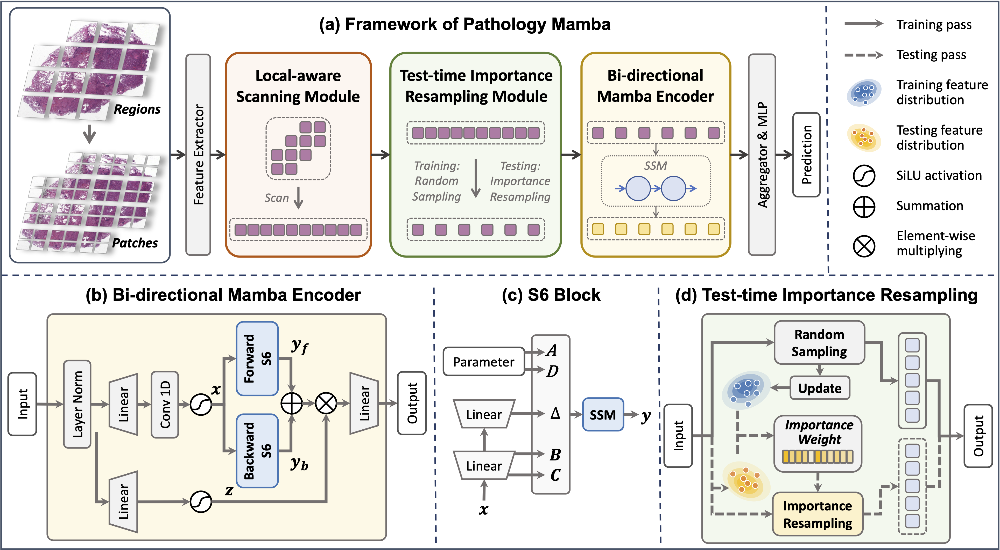

# PAM

## Unleash the Power of State Space Model for Whole Slide Image with Local Aware Scanning and Importance Resampling


### Hierarchical Feature Extraction
```python
# Create regions with resolution of 4096x4096
python create_patches_fp.py

# Extract feature for regions (4096x4096) and patches (512x512)
python extract_features_fp.py
```

### Training
```python
bash scripts/train_pam.sh
```

### Acknowledgements
The project was built on top of amazing repositories such as [CLAM](https://github.com/mahmoodlab/CLAM), [VMamba](https://github.com/MzeroMiko/VMamba). We thank the authors and developers for their contribution.